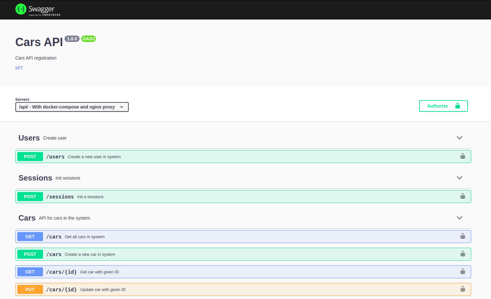

# cars-api

## Run

```bash
sudo docker-compose up --build
```

## Get Documentation

http://localhost:3333/api-docs/



## Postman Collection

https://www.getpostman.com/collections/b491cefa52cdc5245e07

## Run Tests

##### NOT STABLE

```bash
docker exec -it node_carsapi /bin/sh

yarn test
```
